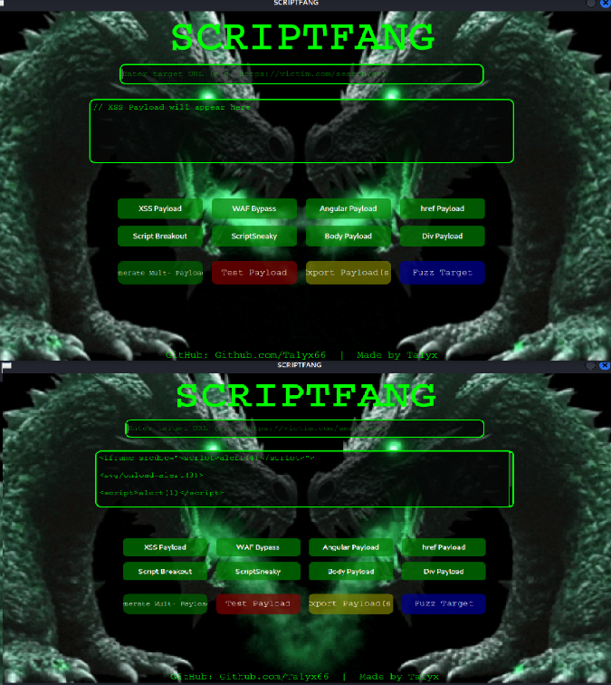
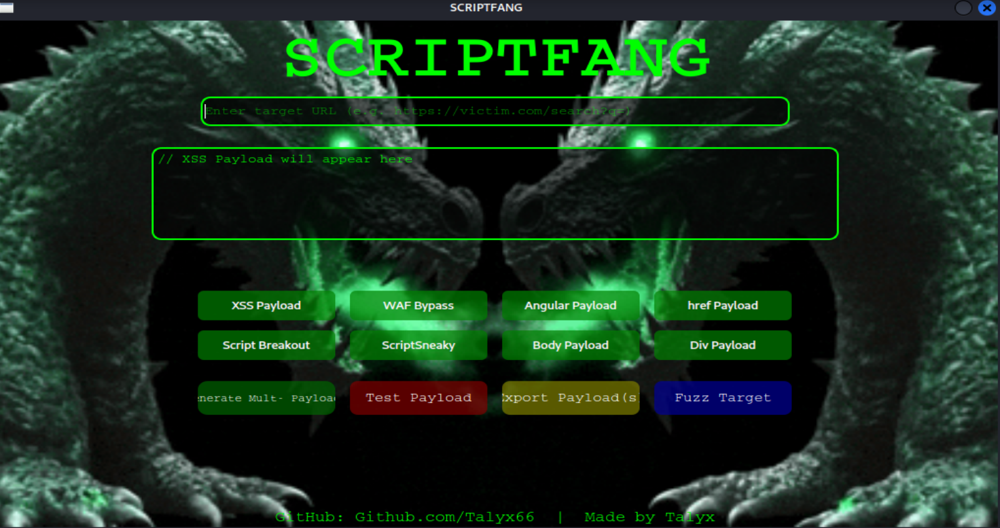

# ScriptFang — Advanced XSS Payload Generator & Fuzzer
Welcome to ScriptFang, the latest addition to the Fang family, my third custom ultimate tool for penetration testers and security researchers to generate, test, and fuzz XSS payloads with power, precision, and style. 

## Features:
 ### |Diverse Payload Generation|
Generate classic, WAF bypass, Angular, script breakout, Cloudflare bypass payloads, and more.

### |Multi-Payload Generation|
Create multiple payloads at once to maximize fuzzing coverage.

### Integrated Fuzzer
Automatically fuzz target URLs with your entire payload arsenal. Tracks reflections, blocks, and errors in real time.

### |Sleek GUI|
PyQt6-powered interface with live feedback, animated background, and intuitive controls.

### |Export Capability|
Save results and payloads in JSON or CSV for offline analysis or manual testing.

## |Installation|
1. Clone the Repository
```bash
1. git clone https://github.com/Talyx66/ScriptFang.git
2. cd ScriptFang
3. Install Requirements 
```
2. Make sure you're using Python 3.9+. Then install dependencies:

```bash
pip install -r requirements.txt
(Ensure PyQt6, requests, beautifulsoup4, and lxml are included in requirements.txt)
```
## |Usage|
1.) Run the tool:

```bash

python3 gui.py
```

### Screenshots





### Preview


## Steps:

2. Enter your target URL (e.g., https://victim.com/search?q=).

3. Choose a payload category or use Multi-Payload Generation.

4. Click Test Payload or Fuzz Target to begin testing.

5. Monitor live output for reflection results or blocks.

6. Export results via the Export Results button.

## Payload Management
1. Payloads are stored in /tools/payloads/

2. Each .txt file corresponds to a specific category

3. Edit or expand these files to supercharge your fuzzing arsenal

## Contribution
Pull requests, payload improvements, and community contributions are always welcome.

## Disclaimer
Use ScriptFang responsibly. Only test systems you have explicit permission to assess.
The creator is not liable for misuse or unauthorized activities.

# Contact
Created by: Talyx
GitHub: github.com/Talyx66
