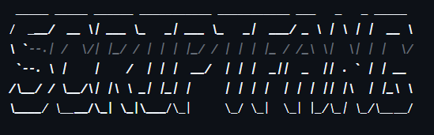
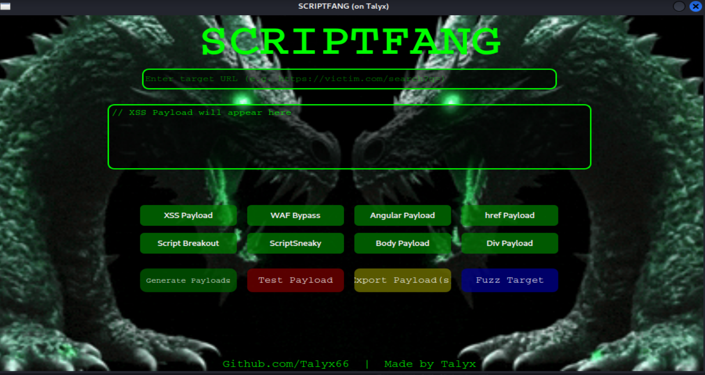

# SCRIPTFANG - Advanced XSS Payload Generator & Fuzzer

## Disclaimer:
* *ScriptFang is a powerful offensive security and payload generation toolkit, intended strictly for experienced cybersecurity professionals, Red-Team operators, and ethical hackers. Use of this tool without proper authorization is illegal and may result in civil and criminal penalties. The creator assumes no liability for any misuse, damage, or legal consequences arising from unauthorized usage. Always obtain explicit permission before using ScriptFang in any environment* *

### Preview



### Live Preview


### Recent Updates 8/17/25
```
updated ReadME format, image resize 
```

# Features:

## |Diverse Payload Generation|
Generate classic, WAF bypass, Angular, script breakout, Cloudflare bypass payloads, and more.

## |Multi-Payload Generation|
Create multiple payloads at once to maximize fuzzing coverage.

## |Integrated Fuzzer|
Automatically fuzz target URLs with your entire payload arsenal. Tracks reflections, blocks, and errors in real time.

## |Sleek GUI|
PyQt6-powered interface with live feedback, animated background, and intuitive controls.

## |Export Capability|
Save results and payloads in JSON or CSV for offline analysis or manual testing.


## Installation:

1.) Clone the Repository
```
1. git clone https://github.com/Talyx66/ScriptFang.git
2. cd ScriptFang
3. Install Requirements 
```
2. (Make sure you're using Python 3.9+. Then install dependencies:)

```
pip install -r requirements.txt
(Ensure PyQt6, requests, beautifulsoup4, and lxml are included in requirements.txt)
```
## Usage:

#### Run the tool:
```
python3 gui.py
```
## Payload Management:
```
1. Payloads are stored in /tools/payloads/

2. Each .txt file corresponds to a specific category

3. Edit or expand these files to supercharge your fuzzing arsenal
```
# Engineered & Developed by:
Talyx   https://Github.com/Talyx66
---
